# Project 01 - Wireshark Fundamentals

## Overview

This project introduces the fundamentals of network packet analysis using Wireshark. It demonstrates how to capture, inspect, and analyze network traffic using industry-standard techniques commonly used by IT Support Engineers, System Administrators, Network Engineers, and Security Operations Center (SOC) analysts.

---

# Objectives

- Install and configure Wireshark
- Capture live network traffic
- Apply display filters
- Inspect packet structure
- Analyze DNS traffic
- Analyze TCP, UDP and ICMP packets
- Follow TCP streams
- Review protocol hierarchy
- Analyze conversations and endpoints

---

# Environment

| Component | Configuration |
|-----------|---------------|
| Operating System | Windows 11 Pro |
| Analysis Tool | Wireshark |
| Capture Format | PCAPNG |
| Network | Home Lab |

---

# Project Structure

```text
01-Wireshark-Fundamentals
│
├── Captures
├── Notes
├── Screenshots
└── README.MD
```

---

# Lab 1 – Wireshark Installation

Verified Wireshark installation and available capture interfaces.

### Screenshot

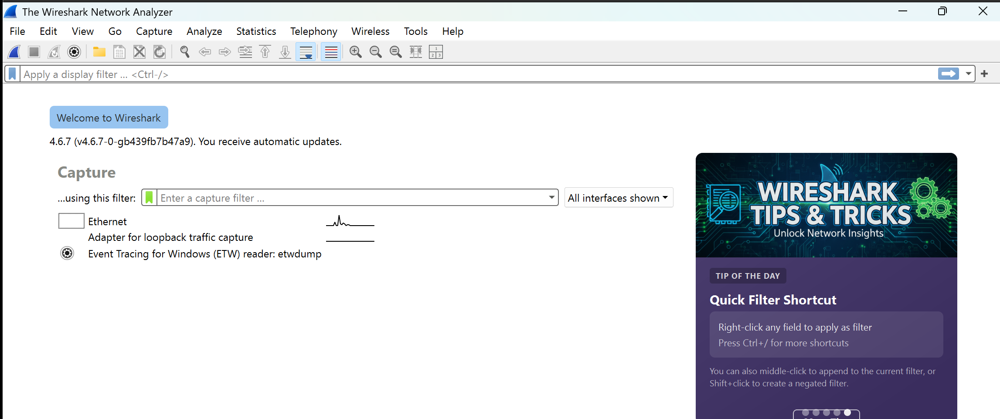

---

# Lab 2 – First Packet Capture

Captured live network traffic for later analysis.

### Capture

`Captures/first_capture.pcapng`

### Screenshot

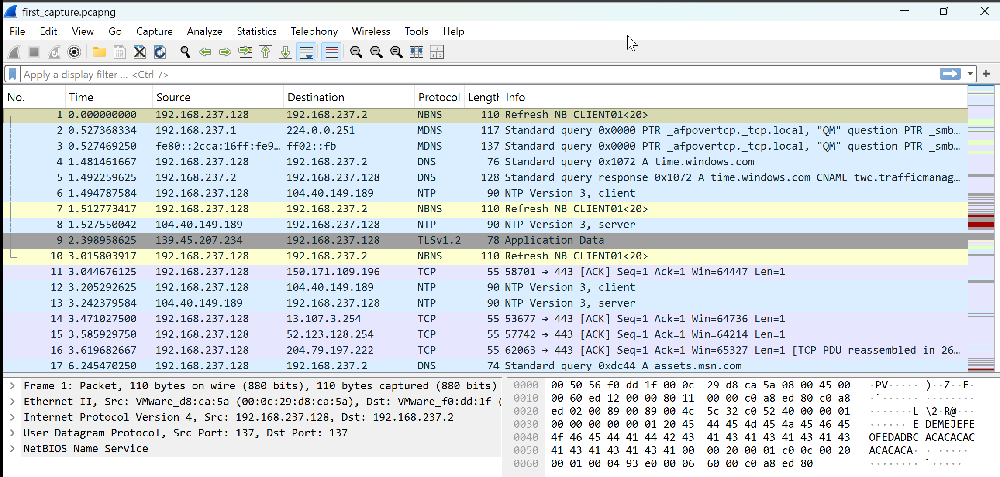

---

# Lab 3 – Wireshark Interface

Reviewed the three primary Wireshark panes:

- Packet List
- Packet Details
- Packet Bytes

### Screenshot

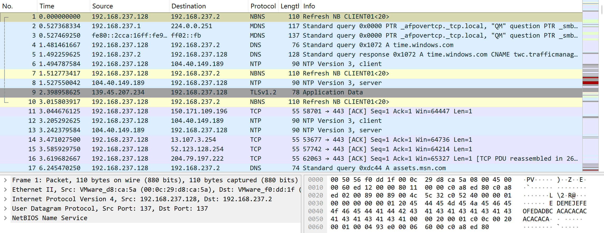

---

# Lab 4 – Display Filters

Applied common protocol filters.

## DNS

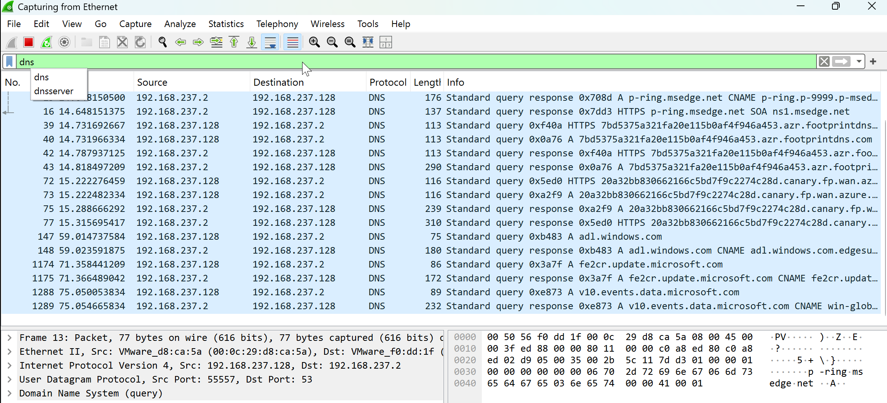

## TCP

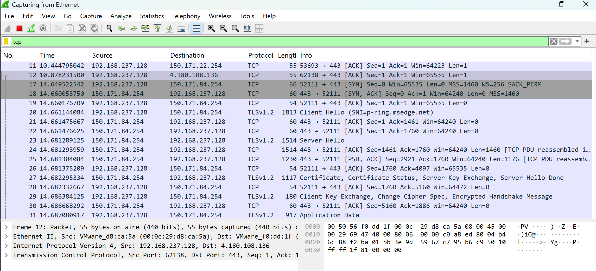

## UDP

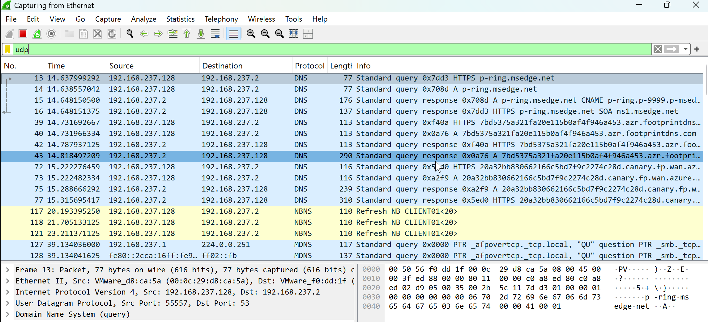

## ICMP

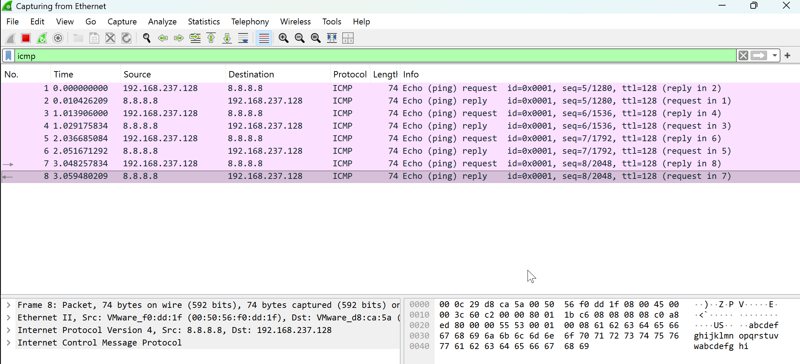

---

# Lab 5 – DNS Packet Analysis

Inspected a DNS query by expanding:

- Ethernet II
- IPv4
- UDP
- DNS

### Screenshot

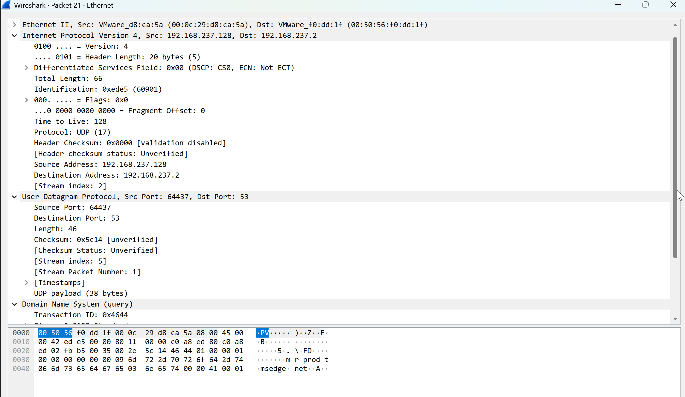

---

# Lab 6 – Packet Bytes

Reviewed the hexadecimal and ASCII representation of the selected packet.

### Screenshot

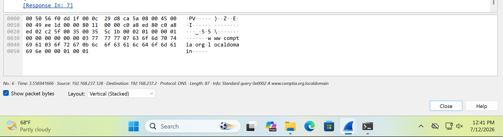

---

# Lab 7 – TCP Stream Analysis

Followed an entire TCP conversation between client and server.

### Screenshot

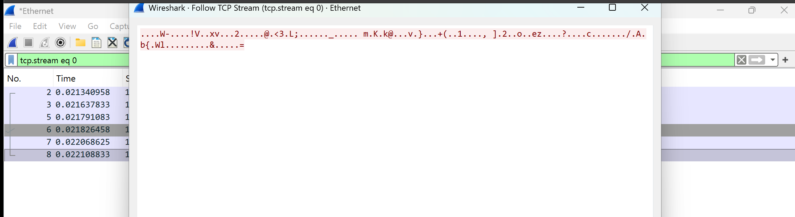

---

# Lab 8 – Protocol Hierarchy

Reviewed captured protocol distribution.

### Screenshot

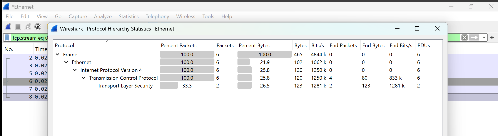

---

# Lab 9 – Conversations

Reviewed network conversations generated during the capture.

### Screenshot

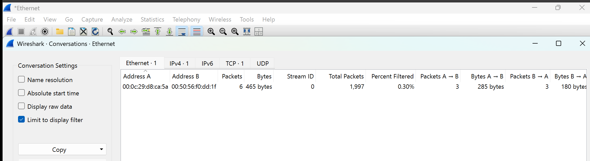

---

# Lab 10 – Endpoints

Reviewed participating network endpoints.

### Screenshot

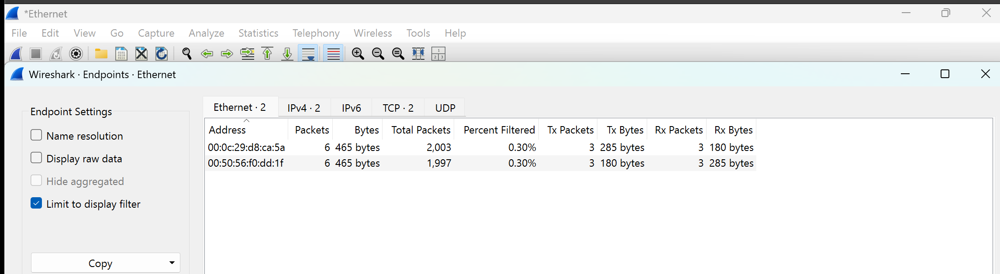

---

# Skills Demonstrated

- Packet Capture
- Packet Inspection
- Protocol Filtering
- DNS Analysis
- TCP Analysis
- UDP Analysis
- ICMP Analysis
- TCP Stream Analysis
- Protocol Hierarchy Analysis
- Conversation Analysis
- Endpoint Analysis
- Network Troubleshooting

---

# Lessons Learned

This project established a strong foundation in packet capture and protocol analysis using Wireshark. Understanding how network traffic flows and how to inspect individual packets is a fundamental skill for enterprise IT Support, networking, and Security Operations (SOC) roles.

---

# Next Project

## Project 02 – TCP Connection Analysis

The next project focuses on analyzing TCP connection establishment, TCP header fields, connection termination, retransmissions, duplicate acknowledgments, and TCP stream behavior using Wireshark.
