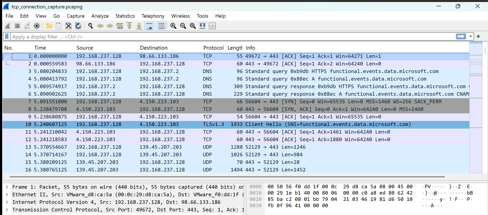
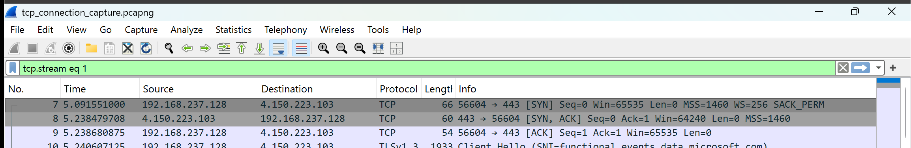
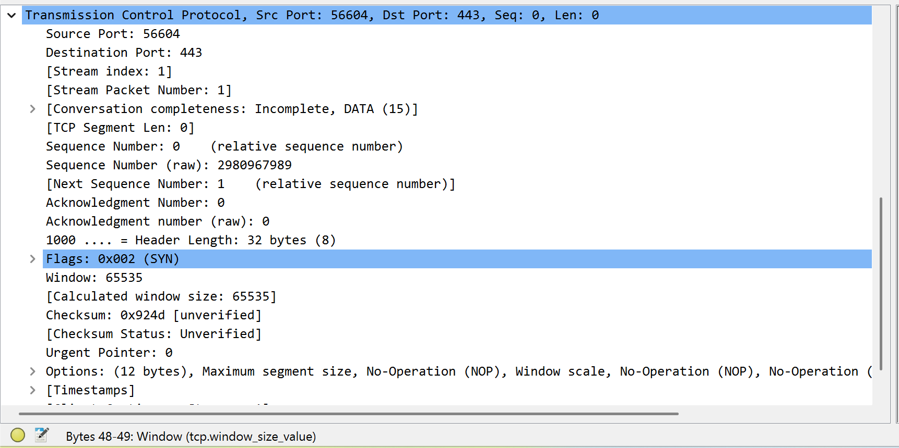
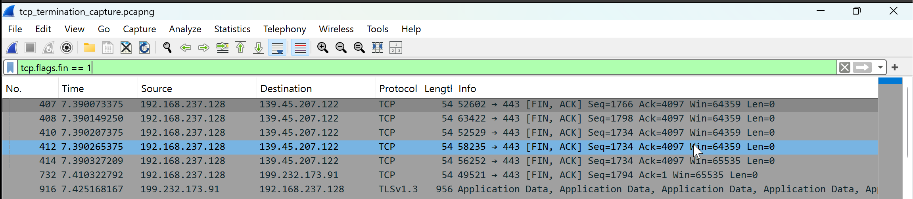
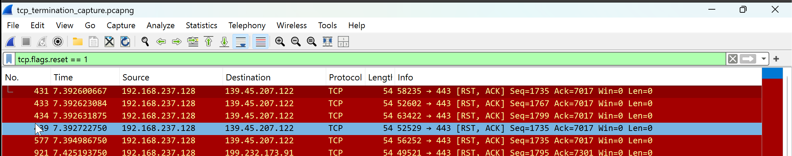
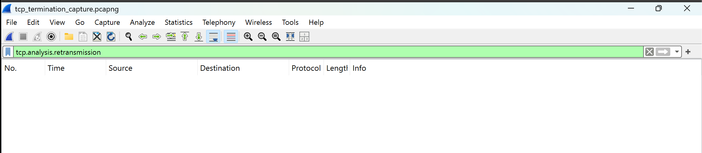
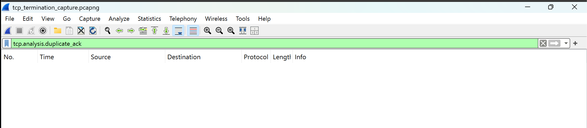
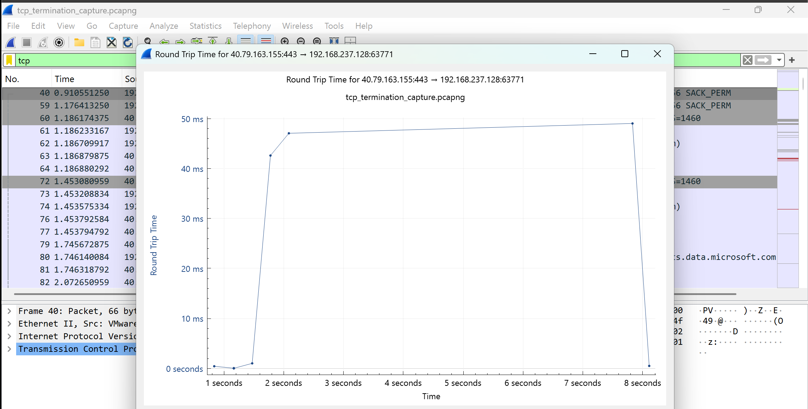

# Project 02 - TCP Connection Analysis

## Overview

This project focuses on analyzing the Transmission Control Protocol (TCP) using Wireshark. It demonstrates how TCP connections are established, maintained, and terminated while investigating common troubleshooting indicators used by IT Support Engineers, Network Administrators, and Security Operations Center (SOC) analysts.

---

# Objectives

- Capture TCP traffic
- Analyze the TCP three-way handshake
- Inspect TCP header fields
- Analyze TCP connection termination
- Investigate TCP Reset (RST) packets
- Analyze retransmissions
- Review duplicate acknowledgments
- Visualize TCP communication using stream graphs

---

# Environment

| Component | Configuration |
|-----------|---------------|
| Operating System | Windows 11 Pro |
| Analysis Tool | Wireshark |
| Capture Format | PCAPNG |
| Network | Home Lab |

---

# Project Structure

```text
02-TCP-Connection-Analysis
│
├── Captures
├── Notes
├── Screenshots
└── README.MD
```

---

# Lab 1 – TCP Packet Capture

Captured TCP traffic generated during normal web browsing.

### Capture

`Captures/tcp_connection_capture.pcapng`

### Screenshot



---

# Lab 2 – TCP Three-Way Handshake

Analyzed TCP connection establishment by identifying:

- SYN
- SYN, ACK
- ACK

### Screenshot



---

# Lab 3 – TCP Header Analysis

Inspected the TCP header and reviewed:

- Source Port
- Destination Port
- Sequence Number
- Acknowledgment Number
- Window Size
- TCP Flags
- Checksum

### Screenshot



---

# Lab 4 – TCP Connection Termination

Observed graceful TCP connection termination using FIN and ACK packets.

### Screenshot



---

# Lab 5 – TCP Reset Analysis

Applied a display filter to identify TCP Reset (RST) packets.

No TCP Reset packets were observed during this capture, indicating normal TCP communication.

### Screenshot



---

# Lab 6 – TCP Retransmission Analysis

Applied retransmission analysis filters.

No retransmissions were observed during this capture, indicating a stable network connection.

### Screenshot



---

# Lab 7 – Duplicate ACK Analysis

Applied duplicate acknowledgment filters.

No duplicate ACK packets were observed during this capture.

### Screenshot



---

# Lab 8 – TCP Stream Graph Analysis

Reviewed TCP communication using Wireshark TCP Stream Graphs.

### Screenshot



---

# Skills Demonstrated

- TCP Packet Capture
- TCP Three-Way Handshake Analysis
- TCP Header Analysis
- TCP Connection Termination
- TCP Reset Analysis
- TCP Retransmission Analysis
- Duplicate ACK Analysis
- TCP Stream Analysis
- Wireshark Filtering
- Enterprise Network Troubleshooting

---

# Lessons Learned

This project provided practical experience analyzing TCP communication using Wireshark. Understanding connection establishment, packet structure, and TCP behavior is fundamental for troubleshooting enterprise network issues and forms a core networking skill for IT Support Engineers, Network Administrators, and future Security Operations (SOC) professionals.

---

# Next Project

## Project 03 – DNS Traffic Analysis

The next project focuses on analyzing DNS queries and responses, DNS record types, name resolution, recursive lookups, and troubleshooting DNS-related connectivity issues using Wireshark.
