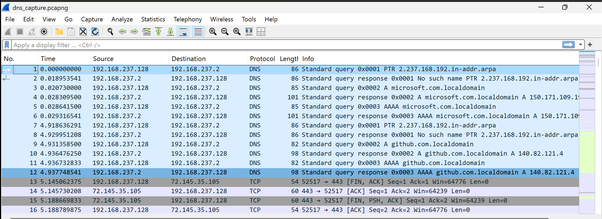
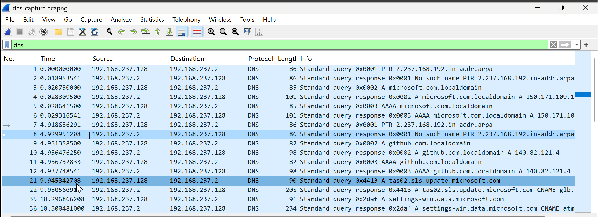
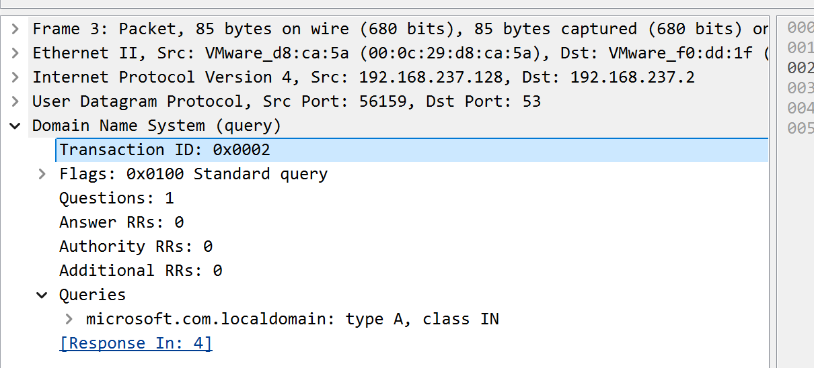
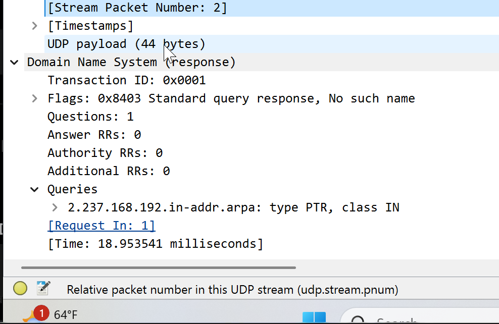
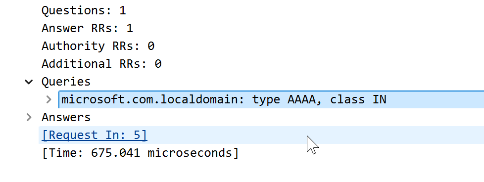
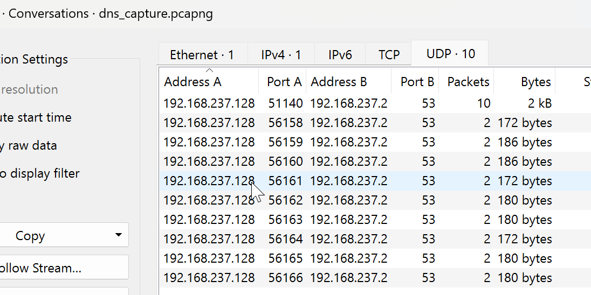
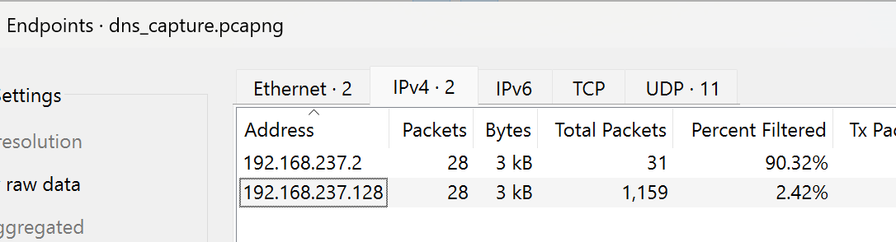

# Project 03 - DNS Traffic Analysis

## Overview

This project demonstrates how to analyze Domain Name System (DNS) traffic using Wireshark. It focuses on capturing DNS queries and responses, examining DNS record types, identifying DNS servers, and troubleshooting name resolution issues commonly encountered in enterprise environments.

The project simulates a real-world IT Support scenario where users report being unable to access websites by hostname.

---

# Scenario

> **A user reports that websites cannot be accessed by hostname, although Internet connectivity is available.**

The objective is to verify whether DNS resolution is functioning correctly by analyzing DNS traffic.

---

# Objectives

- Capture DNS traffic
- Filter DNS packets
- Analyze DNS queries
- Analyze DNS responses
- Identify DNS record types
- Review DNS conversations
- Identify DNS endpoints
- Document DNS troubleshooting findings

---

# Environment

| Component | Configuration |
|-----------|---------------|
| Operating System | Windows 11 Pro |
| Analysis Tool | Wireshark |
| Capture Format | PCAPNG |
| Network | Home Lab |

---

# Project Structure

```text
03-DNS-Traffic-Analysis
│
├── Captures
├── Notes
├── Screenshots
└── README.MD
```

---

# Lab 1 – DNS Packet Capture

Generated DNS traffic using the `nslookup` command.

### Capture

`Captures/dns_capture.pcapng`

### Screenshot



---

# Lab 2 – DNS Display Filter

Applied the DNS display filter to isolate DNS packets.

Display Filter:

```text
dns
```

### Screenshot



---

# Lab 3 – DNS Query Analysis

Inspected a DNS query packet and reviewed:

- Transaction ID
- Flags
- Query Name
- Query Type
- Questions

### Screenshot



---

# Lab 4 – DNS Response Analysis

Reviewed the DNS response and verified:

- Response Code
- Answer Count
- Returned IP Address
- Time To Live (TTL)

### Screenshot



---

# Lab 5 – DNS Record Types

Reviewed DNS resource records returned by the DNS server.

Observed record types included:

- A
- AAAA

### Screenshot



---

# Lab 6 – DNS Conversations

Reviewed DNS communication between the client and DNS server using Wireshark Conversations.

### Screenshot



---

# Lab 7 – DNS Endpoints

Reviewed the participating DNS client and server endpoints.

### Screenshot



---

# Lab 8 – DNS Troubleshooting Summary

Documented the DNS troubleshooting findings, including:

- Client
- DNS Server
- Queried Domains
- Record Types
- Resolution Status
- Investigation Summary

---

# Skills Demonstrated

- DNS Packet Capture
- DNS Query Analysis
- DNS Response Analysis
- DNS Record Identification
- UDP Traffic Analysis
- Wireshark Display Filters
- DNS Troubleshooting
- Enterprise Network Diagnostics

---

# Lessons Learned

This project provided practical experience analyzing DNS communication using Wireshark. Understanding DNS queries, responses, record types, and endpoint communication is essential for diagnosing name resolution issues in enterprise environments. These skills are fundamental for IT Support Engineers, Network Administrators, and Security Operations (SOC) analysts.

---

# Next Project

## Project 04 – DHCP Traffic Analysis

The next project focuses on analyzing the DHCP DORA process (Discover, Offer, Request, Acknowledge) to understand how clients dynamically obtain IP configuration within enterprise networks.
