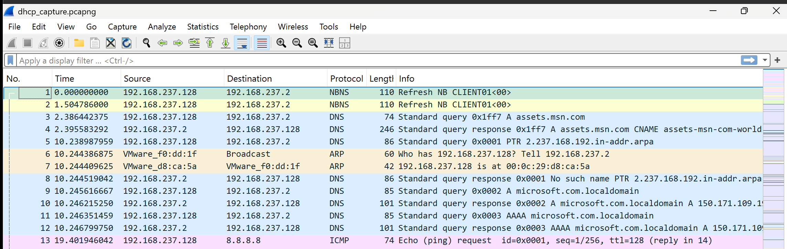
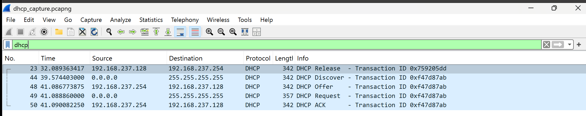
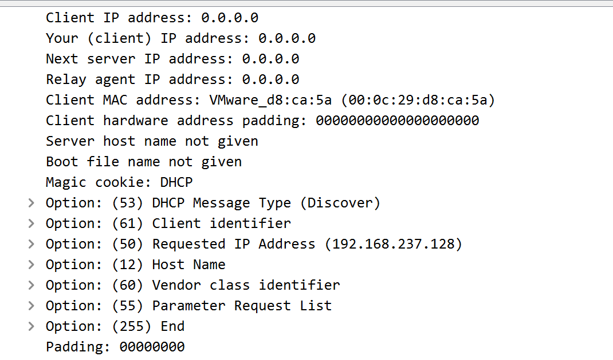
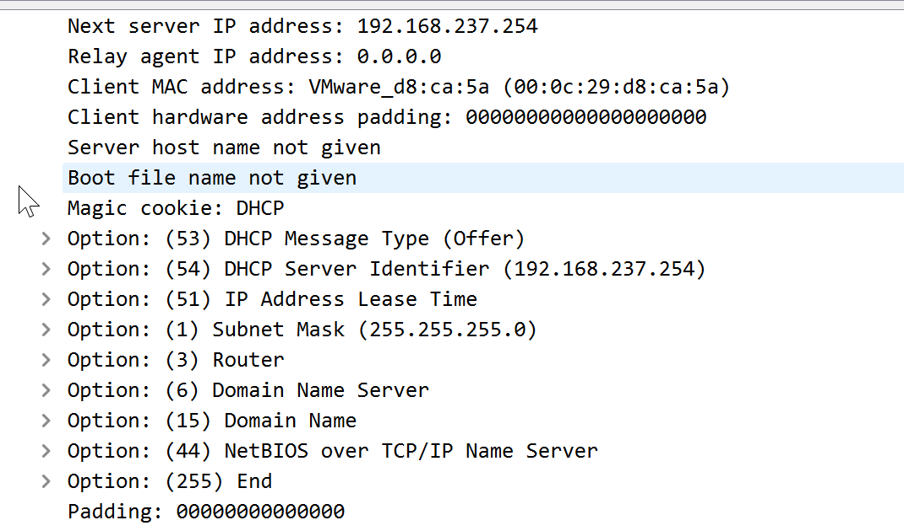
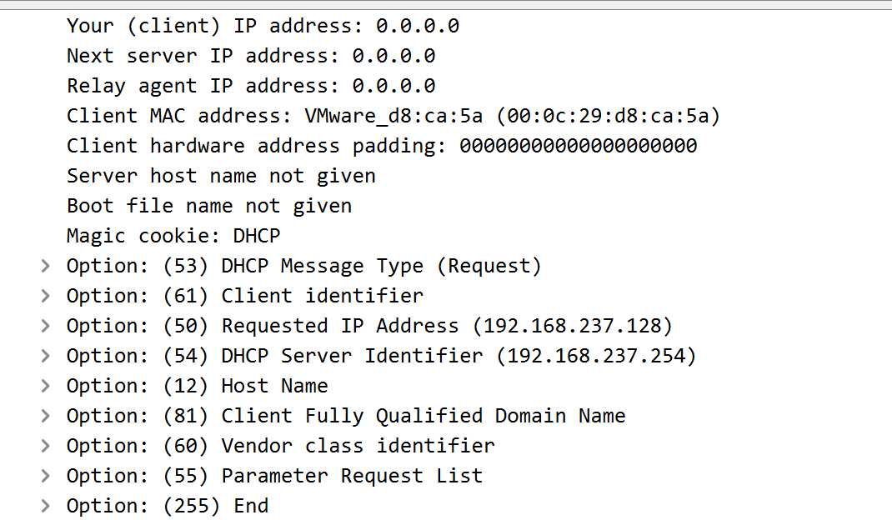
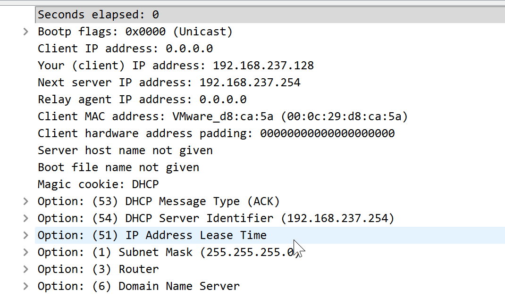
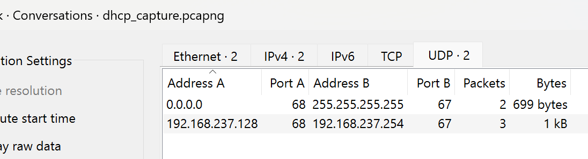

# Project 04 - DHCP Traffic Analysis

## Overview

This project demonstrates how to analyze Dynamic Host Configuration Protocol (DHCP) traffic using Wireshark. It focuses on capturing and analyzing the DHCP DORA (Discover, Offer, Request, Acknowledge) process used to dynamically assign IP addresses within enterprise networks.

The project simulates a common IT Support scenario where a client is unable to obtain an IP address automatically.

---

# Scenario

> **A user reports that their computer cannot obtain an IP address and has no network connectivity.**

The objective is to analyze the DHCP communication and verify that the DORA process completes successfully.

---

# Objectives

- Capture DHCP traffic
- Analyze the DHCP DORA process
- Inspect DHCP Discover packets
- Review DHCP Offer packets
- Analyze DHCP Request packets
- Verify DHCP Acknowledgment (ACK)
- Review DHCP conversations
- Document DHCP troubleshooting findings

---

# Environment

| Component | Configuration |
|-----------|---------------|
| Operating System | Windows 11 Pro |
| Analysis Tool | Wireshark |
| Capture Format | PCAPNG |
| Network | Home Lab |

---

# Project Structure

```text
04-DHCP-Traffic-Analysis
│
├── Captures
├── Notes
├── Screenshots
└── README.MD
```

---

# Lab 1 – DHCP Packet Capture

Captured DHCP traffic while renewing the client IP address.

### Commands

```cmd
ipconfig /release
ipconfig /renew
```

### Capture

`Captures/dhcp_capture.pcapng`

### Screenshot



---

# Lab 2 – DHCP Display Filter

Applied the DHCP display filter to isolate DHCP traffic.

Display Filter:

```text
bootp
```

> *Note: In Wireshark, DHCP packets are commonly decoded under the BOOTP protocol.*

### Screenshot



---

# Lab 3 – DHCP Discover

Inspected the DHCP Discover packet and reviewed:

- Client MAC Address
- Transaction ID
- DHCP Message Type

### Screenshot



---

# Lab 4 – DHCP Offer

Reviewed the DHCP Offer packet and verified:

- Offered IP Address
- DHCP Server Identifier
- Lease Time

### Screenshot



---

# Lab 5 – DHCP Request

Reviewed the DHCP Request packet.

Verified:

- Requested IP Address
- Server Identifier

### Screenshot



---

# Lab 6 – DHCP Acknowledgment

Reviewed the DHCP ACK packet.

Verified:

- Assigned IP Address
- Lease Time
- Default Gateway
- DNS Server

### Screenshot



---

# Lab 7 – DHCP Conversations

Reviewed DHCP communication between the client and DHCP server using Wireshark Conversations.

### Screenshot



---

# Lab 8 – DHCP Troubleshooting Summary

Documented the DHCP troubleshooting findings, including:

- Client
- DHCP Server
- Assigned IP Address
- Lease Status
- DORA Process
- Investigation Summary

---

# Skills Demonstrated

- DHCP Packet Capture
- DHCP DORA Analysis
- DHCP Discover Analysis
- DHCP Offer Analysis
- DHCP Request Analysis
- DHCP ACK Analysis
- BOOTP/DHCP Packet Analysis
- Wireshark Display Filters
- Enterprise DHCP Troubleshooting

---

# Lessons Learned

This project provided practical experience analyzing DHCP communication using Wireshark. Understanding the DORA process is essential for diagnosing IP address assignment issues and network connectivity problems commonly encountered in enterprise IT environments.

---

# Next Project

## Project 05 – HTTP & HTTPS Traffic Analysis

The next project focuses on analyzing web traffic, comparing HTTP and HTTPS communication, examining TLS handshakes, and troubleshooting web connectivity issues using Wireshark.