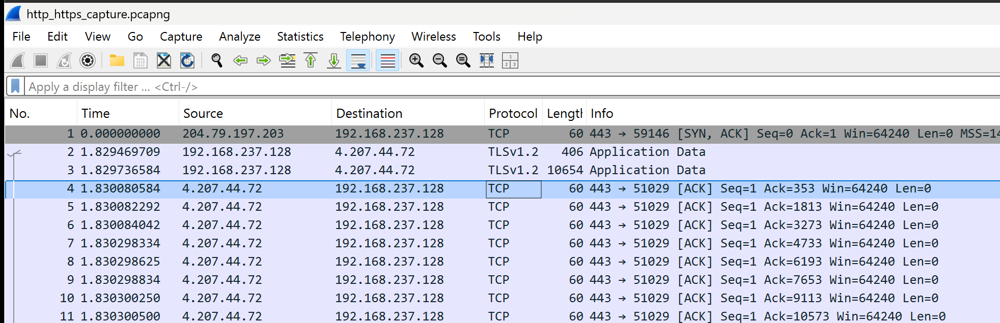
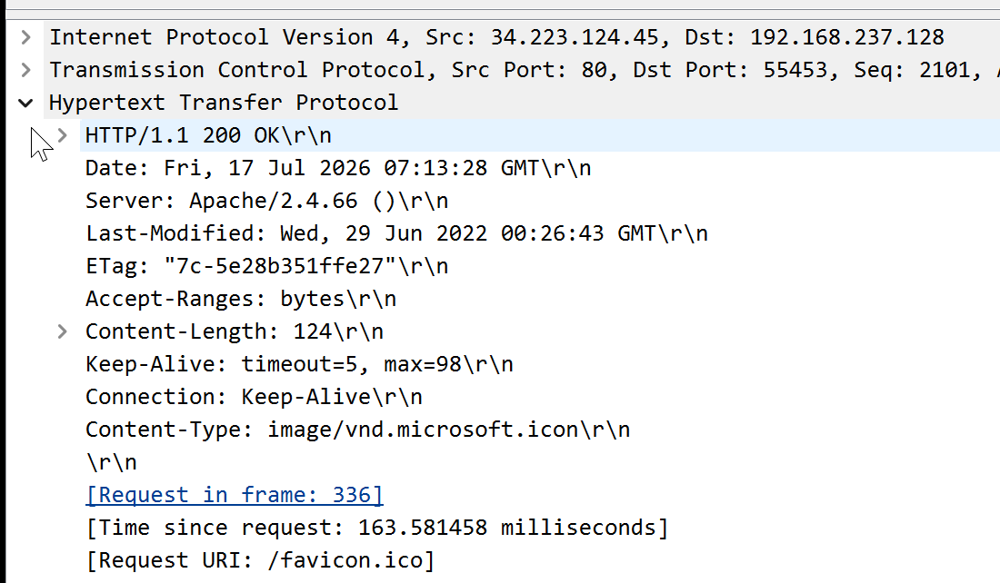
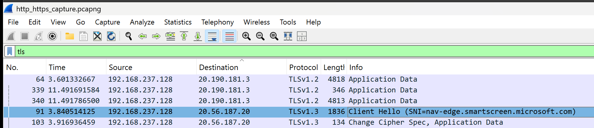
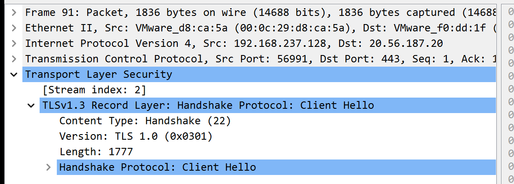
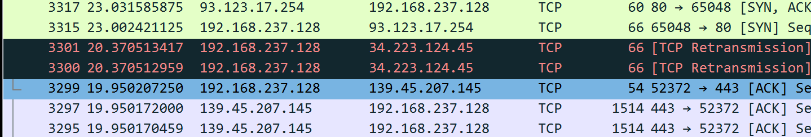
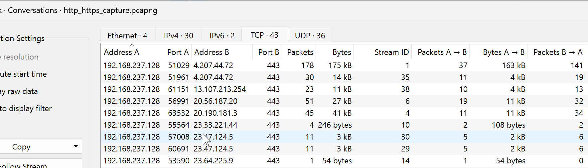
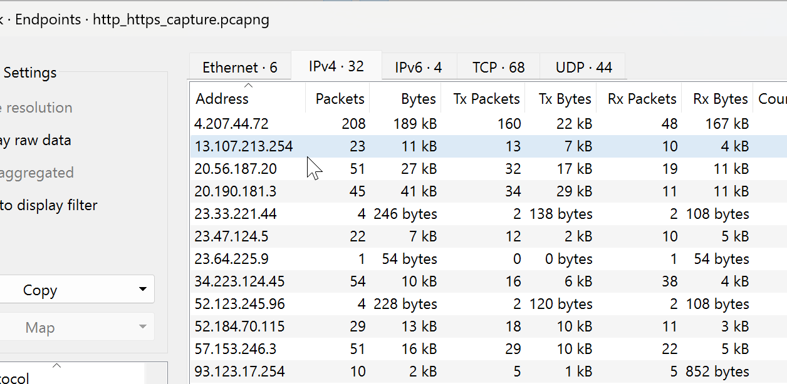

# Project 05 - HTTP & HTTPS Traffic Analysis

## Overview

This project demonstrates how to analyze HTTP and HTTPS communication using Wireshark. It focuses on capturing web traffic, inspecting HTTP requests, analyzing TLS handshakes, reviewing digital certificates, and comparing encrypted and unencrypted communication commonly encountered in enterprise environments.

The project simulates a real-world IT Support scenario where a user reports issues accessing websites or web applications.

---

# Scenario

> **A user reports that a website loads slowly or cannot be accessed.**

The objective is to determine whether the issue is related to HTTP communication, HTTPS encryption, or the TLS handshake.

---

# Objectives

- Capture HTTP and HTTPS traffic
- Analyze HTTP GET requests
- Review TLS handshakes
- Inspect TLS certificates
- Compare HTTP and HTTPS
- Review web conversations
- Identify web endpoints
- Document web troubleshooting findings

---

# Environment

| Component | Configuration |
|-----------|---------------|
| Operating System | Windows 11 Pro |
| Analysis Tool | Wireshark |
| Capture Format | PCAPNG |
| Network | Home Lab |

---

# Project Structure

```text
05-HTTP-HTTPS-Traffic-Analysis
│
├── Captures
├── Notes
├── Screenshots
└── README.MD
```

---

# Lab 1 – HTTP & HTTPS Packet Capture

Captured web traffic while accessing HTTP and HTTPS websites.

### Capture

`Captures/http_https_capture.pcapng`

### Screenshot



---

# Lab 2 – HTTP GET Request

Analyzed an HTTP GET request.

Reviewed:

- Request Method
- Host
- URI
- HTTP Version

### Screenshot



---

# Lab 3 – TLS Handshake

Reviewed the TLS handshake.

Identified:

- Client Hello
- Server Hello

### Screenshot



---

# Lab 4 – TLS Certificate

Reviewed the server certificate.

Verified:

- Subject
- Issuer
- Validity Period

### Screenshot



---

# Lab 5 – HTTP vs HTTPS

Compared encrypted and unencrypted web communication.

Verified:

- Port 80
- Port 443
- Plain Text
- TLS Encryption

### Screenshot



---

# Lab 6 – Web Conversations

Reviewed TCP conversations generated during web communication.

### Screenshot



---

# Lab 7 – Web Endpoints

Reviewed client and web server endpoints.

### Screenshot



---

# Lab 8 – Web Troubleshooting Summary

Documented:

- Websites Tested
- Protocols
- TLS Status
- Investigation Findings
- Conclusion

---

# Skills Demonstrated

- HTTP Analysis
- HTTPS Analysis
- TLS Handshake Analysis
- Certificate Inspection
- Web Traffic Analysis
- Wireshark Filtering
- Enterprise Web Troubleshooting

---

# Lessons Learned

This project provided practical experience analyzing HTTP and HTTPS communication using Wireshark. Understanding web requests, TLS handshakes, and certificate validation is essential for diagnosing web connectivity issues and secure communication in enterprise environments.

---

# Next Project

## Project 06 – SMB Traffic Analysis

The next project focuses on analyzing SMB communication, file sharing traffic, authentication, and troubleshooting access to shared network resources.