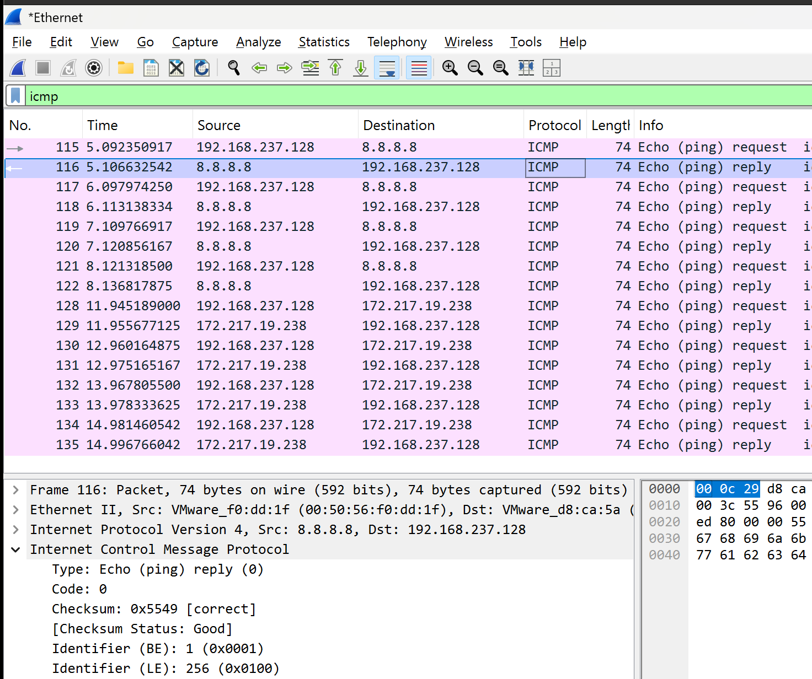

# Project 06 – ICMP Traffic Analysis

## Overview

This project demonstrates how to capture and analyze Internet Control Message Protocol (ICMP) traffic using Wireshark. ICMP is primarily used for network diagnostics and connectivity testing. By generating ICMP traffic with the `ping` utility, this lab examines Echo Request and Echo Reply packets to understand how devices verify network reachability.

---

## Scenario

A Windows 11 client generated ICMP traffic by sending Echo Requests to Google's public DNS server (`8.8.8.8`). The resulting packets were captured using Wireshark to analyze successful communication and verify network connectivity.

---

## Objectives

- Generate ICMP traffic using the `ping` command.
- Capture ICMP packets with Wireshark.
- Analyze Echo Request and Echo Reply packets.
- Identify ICMP packet fields and message types.
- Verify successful network connectivity.

---

## Lab Environment

| Component | Details |
|----------|---------|
| Host Machine | MacBook Air M4 |
| Hypervisor | VMware Fusion |
| Client | Windows 11 Pro |
| Packet Analyzer | Wireshark |
| Destination | 8.8.8.8 (Google Public DNS) |

---

## Project Structure

```text
06-ICMP-Traffic-Analysis
├── README.md
├── Captures
│   └── icmp-analysis.pcapng
├── Notes
│   └── Analysis.md
└── Screenshots
    └── 01_ICMP_Request_Reply.png
```

---

## Lab Steps

1. Started Wireshark and selected the active network adapter.
2. Generated ICMP traffic using the command:

```cmd
ping 8.8.8.8
```

3. Stopped the packet capture after the ping completed.
4. Applied the display filter:

```text
icmp
```

5. Examined the Echo Request and Echo Reply packets.
6. Recorded observations and documented the analysis.

---

## Packet Analysis

The capture showed successful ICMP communication between the Windows 11 client and the destination host.

- ICMP Echo Request (Type 8)
- ICMP Echo Reply (Type 0)
- Four requests transmitted
- Four replies received
- No packet loss observed
- Successful connectivity confirmed

---

## Screenshot



---

## Skills Demonstrated

- Wireshark packet capture
- ICMP protocol analysis
- Network connectivity verification
- Packet inspection
- Basic network troubleshooting
- Technical documentation

---

## Lessons Learned

- ICMP is commonly used to test network connectivity.
- Echo Requests verify whether a destination host is reachable.
- Echo Replies confirm successful communication.
- Wireshark provides detailed visibility into ICMP packet exchanges.
- Packet analysis is an essential skill for diagnosing network issues.

---

## Next Project

**Project 07 – RDP Traffic Analysis**

The next project will analyze Remote Desktop Protocol (RDP) traffic, examining connection establishment and encrypted remote desktop communication using Wireshark.