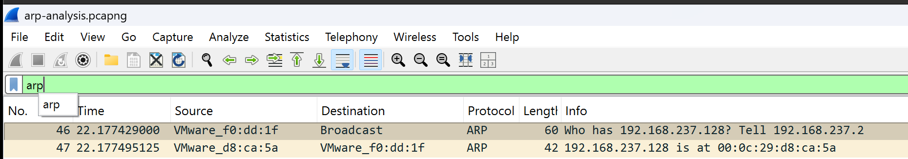

# Project 07 – ARP Traffic Analysis

## Overview

This project demonstrates how Address Resolution Protocol (ARP) resolves IPv4 addresses into MAC addresses on a local network. Using Wireshark, ARP Request and ARP Reply packets were captured and analyzed to understand Layer 2 communication before IP traffic is transmitted.

---

## Scenario

The ARP cache was cleared on a Windows 11 client before generating network traffic by pinging the default gateway. Wireshark captured the resulting ARP exchange used to discover the gateway's MAC address.

---

## Objectives

- Generate ARP traffic
- Capture ARP packets using Wireshark
- Analyze ARP Request and ARP Reply packets
- Understand IPv4-to-MAC address resolution
- Examine Layer 2 communication

---

## Lab Environment

| Component | Details |
|----------|---------|
| Host Machine | MacBook Air M4 |
| Hypervisor | VMware Fusion |
| Client | Windows 11 Pro |
| Packet Analyzer | Wireshark |

---

## Project Structure

```text
07-ARP-Traffic-Analysis
├── README.md
├── Captures
│   └── arp-analysis.pcapng
├── Notes
│   └── Analysis.md
└── Screenshots
    └── 01_ARP_Request_Reply.png
```

---

## Lab Steps

1. Started Wireshark.
2. Cleared the ARP cache using `arp -d *`.
3. Identified the default gateway using `ipconfig`.
4. Generated ARP traffic by pinging the default gateway.
5. Stopped the capture.
6. Applied the `arp` display filter.
7. Examined the ARP Request and Reply packets.

---

## Packet Analysis

The packet capture showed:

- ARP Request (Opcode 1)
- ARP Reply (Opcode 2)
- Broadcast MAC address during the request
- Gateway MAC address returned in the reply
- Successful Layer 2 address resolution

---

## Screenshot



---

## Skills Demonstrated

- Wireshark packet capture
- ARP protocol analysis
- Layer 2 networking
- MAC address resolution
- Network diagnostics
- Technical documentation

---

## Lessons Learned

- ARP maps IPv4 addresses to MAC addresses.
- ARP Requests are broadcast across the local network.
- ARP Replies provide the requested MAC address.
- Successful ARP resolution is required before Ethernet communication can occur.
- Wireshark is an effective tool for analyzing Layer 2 protocols.

---

## Next Project

**Project 08 – Nmap Host Discovery**

The next project demonstrates host discovery using Nmap and analyzes the generated network traffic with Wireshark.