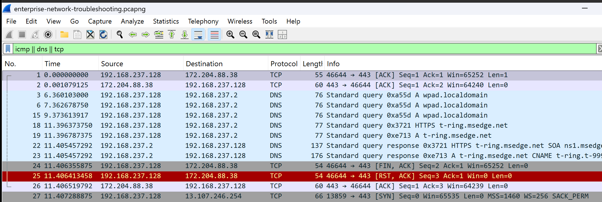

# Project 08 – Enterprise Network Troubleshooting

## Overview

This project demonstrates a systematic approach to troubleshooting network connectivity issues using built-in Windows networking tools and Wireshark. Multiple diagnostic commands were executed to verify network configuration, connectivity, DNS resolution, routing, and active network sessions.

---

## Scenario

A user reports network connectivity problems. The objective is to identify potential issues by verifying network configuration and testing communication across the local network and the Internet.

---

## Objectives

- Verify IP configuration
- Test local network connectivity
- Test Internet connectivity
- Verify DNS resolution
- Analyze routing
- Inspect active TCP connections
- Capture troubleshooting traffic with Wireshark

---

## Lab Environment

| Component | Details |
|----------|---------|
| Host Machine | MacBook Air M4 |
| Hypervisor | VMware Fusion |
| Client | Windows 11 Pro |
| Packet Analyzer | Wireshark |

---

## Project Structure

```text
08-Enterprise-Network-Troubleshooting
├── README.md
├── Captures
│   └── enterprise-network-troubleshooting.pcapng
├── Notes
│   └── Analysis.md
└── Screenshots
    └── 01_Enterprise_Network_Troubleshooting.png
```

---

## Lab Steps

1. Started Wireshark capture.
2. Verified network configuration using `ipconfig /all`.
3. Tested connectivity to the default gateway using `ping`.
4. Tested Internet connectivity using `ping 8.8.8.8`.
5. Verified DNS resolution using `nslookup`.
6. Traced the network path using `tracert`.
7. Reviewed active connections using `netstat -ano`.
8. Applied Wireshark display filters for ICMP, DNS, and TCP traffic.
9. Saved the packet capture and screenshot.

---

## Packet Analysis

The capture included:

- ICMP Echo Requests and Replies
- DNS Queries and Responses
- TCP Sessions
- Routing-related traffic

The captured packets confirmed successful communication during each troubleshooting step.

---

## Screenshot



---

## Skills Demonstrated

- Windows network troubleshooting
- IP configuration analysis
- Connectivity testing
- DNS troubleshooting
- Route analysis
- TCP session inspection
- Wireshark packet analysis
- Enterprise troubleshooting methodology

---

## Lessons Learned

- Proper IP configuration is the foundation of network connectivity.
- Ping confirms local and Internet communication.
- DNS resolution is essential for accessing domain-based services.
- Traceroute identifies the network path between hosts.
- Netstat helps identify active network sessions and listening ports.
- Wireshark complements Windows tools by providing packet-level visibility.

---

## Next Project

**Project 09 – Windows Network Services Analysis**

The next project focuses on analyzing Windows network services and common client-server communication using built-in tools and Wireshark.