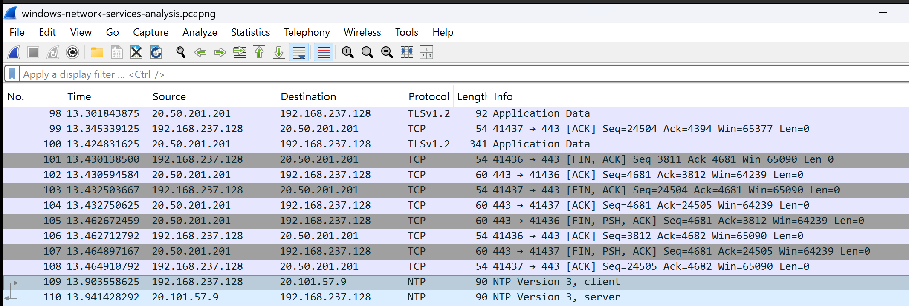

# Project 09 – Windows Network Services Analysis

## Overview

This project analyzes common Windows network services using Wireshark. Traffic was generated using built-in Windows networking tools and standard web browsing activities to observe how Windows communicates with DNS, HTTPS, TCP, and NTP services.

---

## Scenario

An IT Support technician needs to understand how Windows communicates with essential network services. This project captures and analyzes those communications to improve troubleshooting and protocol analysis skills.

---

## Objectives

- Capture Windows network service traffic
- Analyze DNS communication
- Observe HTTPS and TLS traffic
- Examine TCP communication
- Analyze Windows time synchronization
- Develop packet analysis skills using Wireshark

---

## Lab Environment

| Component | Details |
|----------|---------|
| Host Machine | MacBook Air M4 |
| Hypervisor | VMware Fusion |
| Client | Windows 11 Pro |
| Packet Analyzer | Wireshark |

---

## Project Structure

```text
09-Windows-Network-Services-Analysis
├── README.md
├── Captures
│   └── windows-network-services-analysis.pcapng
├── Notes
│   └── Analysis.md
└── Screenshots
    └── 01_Windows_Network_Services.png
```

---

## Lab Steps

1. Started Wireshark capture.
2. Performed DNS lookups using `nslookup`.
3. Accessed secure websites using HTTPS.
4. Executed `w32tm /resync` to synchronize system time.
5. Observed TCP communication.
6. Applied protocol filters for DNS, TLS, TCP, and NTP.
7. Saved the packet capture and screenshot.

---

## Packet Analysis

The capture included:

- DNS Queries and Responses
- TCP Three-Way Handshake
- TLS Handshake
- Encrypted HTTPS Traffic
- Windows Time Synchronization (NTP)

These packets demonstrate how Windows communicates with common enterprise network services.

---

## Screenshot



---

## Skills Demonstrated

- Windows networking
- DNS analysis
- HTTPS and TLS analysis
- TCP communication
- Network Time Protocol (NTP)
- Wireshark packet analysis
- Enterprise network troubleshooting
- Network protocol analysis

---

## Lessons Learned

- Windows relies on DNS before establishing network connections.
- HTTPS secures communication using TLS encryption.
- TCP provides reliable communication through connection-oriented sessions.
- Windows periodically synchronizes its system clock using NTP.
- Wireshark enables detailed inspection of network protocols and communication flows.

---

## Next Project

**Project 10 – Network Security Monitoring with Wireshark**

The next project focuses on identifying suspicious network activity, analyzing abnormal traffic patterns, and applying packet analysis techniques commonly used in enterprise environments.